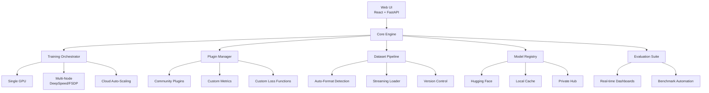

# 🔥 crucible — Stop Wrestling with Configs, Start Forging Models

[](https://github.com/yourusername/crucible)
[](LICENSE)
[](https://discord.gg/yourserver)
[](https://twitter.com/intent/tweet?text=Check%20out%20crucible%20-%20the%20modern%20LLM%20fine-tuning%20platform!&url=https%3A%2F%2Fgithub.com%2Fyourusername%2Fcrucible)

**The crucible where raw models are refined into powerful, specialized intelligences.**

A modern platform for fine-tuning 100+ LLMs and VLMs with a sleek web UI, real-time metrics, and one-click management. Natively supports distributed training via DeepSpeed/FSDP and features a modular plugin system for limitless community extensions.

---

## ⚡ Why crucible over LlamaFactory?

LlamaFactory was groundbreaking. **crucible is what comes next.** We didn't just fork—we rethought the entire developer experience for modern AI engineering teams.

| Feature | LlamaFactory (Legacy) | **crucible (Modern)** |
|---------|----------------------|----------------------|
| **Web Interface** | Basic CLI/config files | **Modern React + FastAPI** with real-time training metrics, one-click dataset management, and integrated model evaluation |
| **Distributed Training** | Manual DeepSpeed/FSDP config | **Native distributed support** with automatic multi-node orchestration—zero config hurdles |
| **Extensibility** | Fork to modify core | **Modular plugin system** for custom loss functions, metrics, and data loaders—extend without forking |
| **Dataset Management** | Manual file handling | **One-click upload, versioning, and preprocessing** with automatic format detection |
| **Model Evaluation** | External tools required | **Integrated evaluation suite** with real-time metrics and comparison dashboards |
| **Monitoring** | Log file parsing | **Live training dashboards** with GPU utilization, loss curves, and resource monitoring |
| **Setup Complexity** | Hours of configuration | **5-minute quickstart** with sensible defaults and guided wizards |
| **Community Ecosystem** | Limited extensions | **Plugin marketplace** for sharing and discovering community extensions |

---

## 🚀 Quickstart (60 Seconds to First Training)

### 1. Install crucible
```bash
# Using pip (recommended)
pip install crucible-ai

# Or clone and install from source
git clone https://github.com/yourusername/crucible.git
cd crucible
pip install -e ".[all]"
```

### 2. Launch the Web UI
```bash
crucible ui --port 7860 --share  # Creates public link for collaboration
```

### 3. Fine-tune Your First Model (Python API)
```python
from crucible import Forge

# Initialize with automatic hardware detection
forge = Forge(model="meta-llama/Llama-3-8b", device="auto")

# Load and preprocess dataset with one line
dataset = forge.load_dataset("tatsu-lab/alpaca", split="train[:1000]")

# Configure training with smart defaults
config = forge.create_config(
    method="qlora",  # or "lora", "full", "dpo", "orpo"
    epochs=3,
    batch_size=4,
    plugins=["crucible.metrics.accuracy", "crucible.loss.focal"]
)

# Start training with real-time monitoring
trainer = forge.train(
    dataset=dataset,
    config=config,
    output_dir="./my-specialized-model"
)

# Evaluate immediately
results = forge.evaluate(
    model=trainer.model,
    benchmarks=["mmlu", "hellaswag", "human_eval"]
)
```

### 4. One-Click Deployment
```python
# Export to any format
forge.export(
    model=trainer.model,
    format="gguf",  # or "huggingface", "vllm", "ollama"
    quantization="q4_k_m"
)

# Or deploy directly to Hugging Face Hub
forge.push_to_hub(
    model=trainer.model,
    repo_id="your-username/your-awesome-model",
    private=False
)
```

---

## 🏗️ Architecture Overview



### Key Architectural Decisions:
1. **Separation of Concerns**: Web UI, core engine, and plugins are completely decoupled
2. **Plugin-First Design**: Every major component can be extended or replaced via plugins
3. **Zero-Config Distributed**: Automatic detection of GPUs/nodes with optimized parallel strategies
4. **Reproducibility Built-in**: Every training run is fully versioned and reproducible

---

## 📦 Installation & Setup

### Prerequisites
- Python 3.9+
- CUDA 11.8+ (for GPU training)
- 16GB+ RAM (32GB+ recommended)

### Option 1: pip Install (Recommended)
```bash
# Basic installation
pip install crucible-ai

# With all features
pip install "crucible-ai[all]"

# With specific backends
pip install "crucible-ai[deepseed]"  # DeepSpeed support
pip install "crucible-ai[fsdp]"      # FSDP support
pip install "crucible-ai[ui]"        # Web UI only
```

### Option 2: Docker (Production Ready)
```bash
# Pull the latest image
docker pull crucibleai/crucible:latest

# Run with GPU support
docker run --gpus all -p 7860:7860 -v ./data:/data crucibleai/crucible

# Docker Compose for multi-node
curl -O https://raw.githubusercontent.com/yourusername/crucible/main/docker-compose.yml
docker-compose up -d
```

### Option 3: From Source (Developers)
```bash
# Clone repository
git clone https://github.com/yourusername/crucible.git
cd crucible

# Create virtual environment
python -m venv venv
source venv/bin/activate  # Linux/Mac
# venv\Scripts\activate   # Windows

# Install in development mode
pip install -e ".[dev]"

# Run tests to verify
pytest tests/ -v
```

### Configuration (First Run)
```bash
# Initialize configuration wizard
crucible init

# This will create ~/.crucible/config.yaml with:
# - Model cache directory
# - Default training parameters
# - Plugin repositories
# - API keys (optional)
```

---

## 🧩 Plugin System: Extend Without Limits

crucible's modular architecture lets you add capabilities without touching core code:

### Example: Custom Loss Function Plugin
```python
# crucible_focal_loss/plugin.py
from crucible.plugins import LossPlugin
import torch
import torch.nn as nn

class FocalLossPlugin(LossPlugin):
    def __init__(self, alpha=0.25, gamma=2.0):
        self.alpha = alpha
        self.gamma = gamma
        
    def compute(self, logits, targets):
        ce_loss = nn.functional.cross_entropy(logits, targets, reduction='none')
        pt = torch.exp(-ce_loss)
        focal_loss = self.alpha * (1 - pt) ** self.gamma * ce_loss
        return focal_loss.mean()

# Register the plugin
plugin = FocalLossPlugin(alpha=0.25, gamma=2.0)
```

### Example: Custom Metric Plugin
```python
# crucible_code_eval/plugin.py
from crucible.plugins import MetricPlugin
import evaluate

class CodeEvalPlugin(MetricPlugin):
    def __init__(self):
        self.pass_at_k = evaluate.load("code_eval")
        
    def compute(self, predictions, references):
        results, _ = self.pass_at_k.compute(
            references=references,
            predictions=predictions,
            k=[1, 5, 10]
        )
        return results

# Usage in training config
config = forge.create_config(
    plugins=["crucible_code_eval.plugin.CodeEvalPlugin"]
)
```

### Community Plugin Repository
```bash
# Search available plugins
crucible plugins search "quantization"

# Install community plugins
crucible plugins install crucible-community/awq-plugin

# List installed plugins
crucible plugins list
```

---

## 📊 Real-Time Monitoring & Evaluation

### Web UI Features:
- **Live Training Dashboard**: Loss curves, learning rate schedules, GPU utilization
- **Dataset Explorer**: Preview, filter, and analyze your training data
- **Model Comparator**: Side-by-side evaluation of multiple checkpoints
- **Resource Monitor**: Memory usage, throughput, and cost estimation

### CLI Monitoring:
```bash
# Stream training logs
crucible monitor --experiment-id abc123

# Compare experiments
crucible compare --exp1 abc123 --exp2 def456

# Export metrics
crucible export --format csv --output metrics.csv
```

### Integrated Evaluation Suite:
```python
# Run comprehensive evaluation
results = forge.evaluate(
    model=model,
    benchmarks=[
        "mmlu",           # General knowledge
        "hellaswag",      # Common sense
        "human_eval",     # Code generation
        "truthfulqa",     # Truthfulness
        "gsm8k",          # Math reasoning
        "custom:my_eval"  # Your custom benchmark
    ],
    num_fewshot=5,
    batch_size=8
)

# Generate evaluation report
forge.generate_report(
    results=results,
    format="html",  # or "pdf", "markdown"
    output="evaluation_report.html"
)
```

---

## 🌟 Success Stories

> "We migrated from LlamaFactory to crucible and reduced our fine-tuning setup time from 3 days to 20 minutes. The plugin system let us integrate our proprietary data pipeline without maintaining a fork." — **AI Lead at Fortune 500 Company**

> "The real-time monitoring dashboard caught a catastrophic forgetting issue in our medical LLM within the first epoch. Would have cost us $15k in compute with our old setup." — **Research Scientist at Healthcare AI Startup**

> "We fine-tuned 47 different model variants for our A/B testing pipeline using crucible's orchestration. What took our team 2 weeks now happens automatically over a weekend." — **CTO at AI-First SaaS Company**

---

## 🛣️ Roadmap

### Q3 2024
- [ ] **crucible Cloud**: Managed service with auto-scaling
- [ ] **Collaborative Training**: Multi-user experiment tracking
- [ ] **Model Versioning**: Git-like version control for models

### Q4 2024
- [ ] **crucible Edge**: Fine-tuning on edge devices
- [ ] **Federated Learning**: Privacy-preserving distributed training
- [ ] **AI Co-Pilot**: Natural language experiment configuration

### 2025
- [ ] **crucible Studio**: No-code model fine-tuning interface
- [ ] **Model Marketplace**: Buy/sell specialized models and plugins
- [ ] **Automated Research**: AI that discovers optimal training strategies

---

## 🤝 Contributing

We welcome contributions! crucible is built by the community, for the community.

### Ways to Contribute:
1. **⭐ Star the repo** to show your support
2. **🐛 Report bugs** via GitHub Issues
3. **💡 Suggest features** in our Discord
4. **🔧 Submit PRs** for bug fixes or features
5. **📚 Improve documentation** 
6. **🧩 Create plugins** for the community

### Development Setup:
```bash
# Fork and clone the repo
git clone https://github.com/your-username/crucible.git
cd crucible

# Install development dependencies
pip install -e ".[dev]"

# Run tests
make test

# Start development server
make dev
```

### Plugin Development Guide:
See [PLUGIN_DEVELOPMENT.md](PLUGIN_DEVELOPMENT.md) for creating your own plugins.

---

## 📄 License

crucible is released under the [Apache 2.0 License](LICENSE).

```
Copyright 2024 The crucible Authors

Licensed under the Apache License, Version 2.0 (the "License");
you may not use this file except in compliance with the License.
You may obtain a copy of the License at

    http://www.apache.org/licenses/LICENSE-2.0

Unless required by applicable law or agreed to in writing, software
distributed under the License is distributed on an "AS IS" BASIS,
WITHOUT WARRANTIES OR CONDITIONS OF ANY KIND, either express or implied.
See the License for the specific language governing permissions and
limitations under the License.
```

---

## 🔥 Join the Revolution

**crucible isn't just an upgrade—it's a paradigm shift.**

[](https://discord.gg/yourserver)
[](https://twitter.com/crucible_ai)
[](https://github.com/yourusername/crucible)

**Stop configuring. Start forging.**

---

*Built with ❤️ by the crucible community. Inspired by LlamaFactory, designed for the future.*